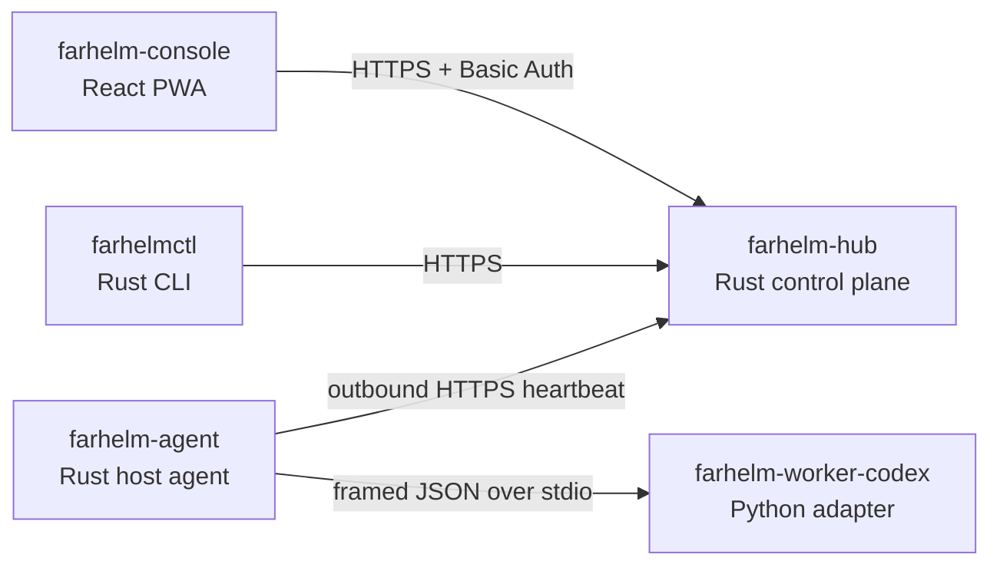

# FarHelm

[简体中文](README.md) · [English](README.en.md)

FarHelm is a remote control plane for personal research and GPU training environments. It brings server health, training jobs, and Codex sessions from multiple machines into one mobile-first web console while keeping training hosts outbound-only and retaining source code and credentials locally.

> Current status: `V0.2.0`, the single-file installation release. Hub and Agent each provide one executable installer that performs safe extraction, service registration, and health checks internally. Installed systems retain immutable-Release self-upgrades, atomic switching, and local rollback. The only enabled action remains the side-effect-free `agent.probe`.

## Architecture



FarHelm is one product in one monorepo, while each runtime role retains least privilege and an independent deliverable:

| Component | Responsibility | Stack |
| --- | --- | --- |
| `farhelm-hub` | Public API, state, and control plane | Rust, Axum, Tokio |
| `farhelm-agent` | Host state, jobs, and Worker supervision | Rust, Tokio |
| `farhelm-console` | Mobile and desktop console | React, TypeScript, Ant Design, Vite PWA |
| `farhelm-worker-codex` | Isolated Codex SDK adapter | Python 3.12, uv |
| `farhelmctl` | Installation, diagnostics, and management | Rust, Clap |

Shared Rust types live under `crates/`. Hub and Agent are compiled separately and the Worker does not listen on a network socket. A deployment bundle lets Hub serve Console; Vite still proxies to Hub during development.

## Quick start

You need Rust 1.98, Node.js 24, Corepack, Python 3.12, and [uv](https://docs.astral.sh/uv/).

```bash
corepack pnpm@10.17.1 --dir farhelm-console install
uv sync --project farhelm-worker-codex --all-groups
```

Build Console and start Hub with loopback-only test credentials:

```bash
corepack pnpm@10.17.1 --dir farhelm-console build
FARHELM_ADMIN_USER=admin \
FARHELM_ADMIN_PASSWORD=local-password-1234 \
FARHELM_AGENT_TOKEN=local-agent-token-with-at-least-32-characters \
FARHELM_CONSOLE_DIR=farhelm-console/dist \
FARHELM_HUB_DATABASE=.farhelm/hub.db \
cargo run -p farhelm-hub
```

Start Console in another terminal:

```bash
corepack pnpm@10.17.1 --dir farhelm-console dev
```

Open `http://127.0.0.1:5173`. Hub exposes its health endpoint at `http://127.0.0.1:8787/api/v1/health`.

Verify the CLI and Worker:

```bash
cargo run -p farhelmctl -- health
cargo run -p farhelm-agent -- worker-smoke
```

Send one local Agent heartbeat:

```bash
FARHELM_HUB_URL=http://127.0.0.1:8787 \
FARHELM_AGENT_TOKEN=local-agent-token-with-at-least-32-characters \
FARHELM_AGENT_ID=gpu-a \
cargo run -p farhelm-agent -- heartbeat
```

## Deployment bundles

Build role archives and two single-file Linux x86_64 installers. The current binary target is Ubuntu 24.04 x86_64 or a compatible glibc 2.39+ system:

```bash
make release
make test-release
```

End users need no compilation, manual verification, or archive extraction. Download and run this on the Hub server:

```bash
curl -fL https://github.com/Xiiiing/FarHelm/releases/latest/download/farhelm-hub-linux-x86_64 -o farhelm-hub
chmod +x farhelm-hub
sudo ./farhelm-hub
```

On a training host, download and run the Agent as the regular user. The installer interactively asks for the Hub URL, Agent ID, and a hidden token:

```bash
curl -fL https://github.com/Xiiiing/FarHelm/releases/latest/download/farhelm-agent-linux-x86_64 -o farhelm-agent
chmod +x farhelm-agent
./farhelm-agent
```

The Agent needs no root/sudo. No extracted directory is left in the download location, and the installer file can be deleted after success. See the [deployment guide](deploy/README.en.md) for managed paths, systemd, Caddy, non-interactive setup, archive fallback, and removal. Hub must remain on loopback and be exposed only through an HTTPS reverse proxy.

After the initial `V0.2.0` installation, later releases need no manual download: use `farhelmctl upgrade --check` / `sudo farhelmctl upgrade` for Hub and `farhelm-agent upgrade --check` / `farhelm-agent upgrade` for Agent. A failed upgrade restores the previous version, while configuration and databases remain outside version directories.

## Development checks

```bash
make check
make test
make privacy
```

Each ecosystem can also be tested independently:

```bash
cargo test --workspace
corepack pnpm@10.17.1 --dir farhelm-console test
uv run --project farhelm-worker-codex pytest
```

## Security boundaries

- Training hosts do not need new public inbound ports.
- Training-host Agents need no root or system-directory writes; they use only XDG user data and a user-level systemd unit.
- Hub rejects non-loopback binds; Caddy or an equivalent reverse proxy terminates public TLS.
- Admin credentials and the Agent token are independent and stored in permission-restricted `/etc/farhelm/*.env` files.
- Hub does not store Codex login credentials, SSH private keys, or project source code.
- Worker communicates with Agent only over stdin/stdout and exposes no network service.
- The first release does not expose an arbitrary remote shell; future mutations require allowlists, TTLs, idempotency, and auditing.
- Example configuration must never include real credentials or private server paths.
- Self-upgrade accepts only immutable uppercase `V*` Releases from the fixed official repository, never an arbitrary source; crossing the first version number requires explicit user permission.

## Roadmap

1. Add WSS wakeups and an Agent event outbox on top of the validated durable command foundation.
2. Stabilize the Agent–Worker protocol and validate the Codex SDK lifecycle.
3. Complete training-job and Codex session flows for one training host.
4. Add GPU and training-job metrics, logs, and notifications.
5. Expand to multiple hosts with per-Agent identities and validate canary upgrades.

## License

FarHelm is licensed under the [Apache License 2.0](LICENSE).
