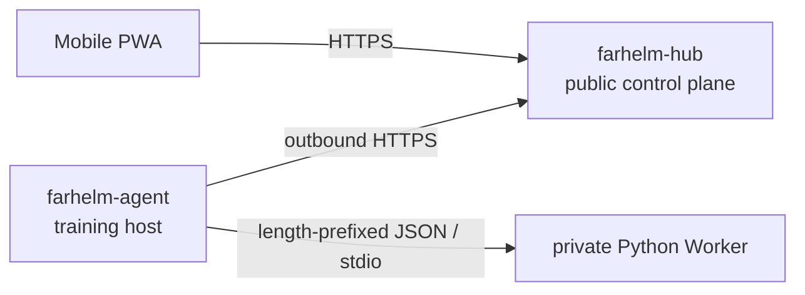

<div align="center">
  
  <h1>FarHelm</h1>
  <p><strong>A remote control plane for personal research and GPU training environments</strong></p>
  <p>See training-host status from your phone and safely extend remote control without exposing inbound ports on training machines.</p>
  <p>
    <a href="https://github.com/Xiiiing/FarHelm/releases/tag/V0.3.0">V0.3.0</a> ·
    <a href="./deploy/README.en.md">Deployment guide</a> ·
    <a href="./README.md">简体中文</a>
  </p>
</div>

> [!IMPORTANT]
> The current `V0.3.0` release provides Hub health checks, Agent heartbeat and listing, durable command state, and the side-effect-free `agent.probe`. GPU metrics, training control, Codex sessions, and Web Push remain on the roadmap; this README does not present planned capabilities as implemented.

## Quick install

Formal programs target Ubuntu 24.04 x86_64, or a compatible system with systemd and glibc 2.39+. The downloaded file is the actual program; no archive extraction is required.

### Hub

Run on the public server. The download can be kept under `/apps`:

```bash
cd /apps
curl -fL https://github.com/Xiiiing/FarHelm/releases/latest/download/farhelm-hub-linux-x86_64 -o farhelm-hub
chmod +x farhelm-hub
sudo ./farhelm-hub install
```

The program prompts for the administrator username, administrator password, and Agent token. The installed program is `/usr/local/bin/farhelm-hub`.

### Agent

Run as the target regular user on each training host; do not use sudo:

```bash
mkdir -p "$HOME/apps"
cd "$HOME/apps"
curl -fL https://github.com/Xiiiing/FarHelm/releases/latest/download/farhelm-agent-linux-x86_64 -o farhelm-agent
chmod +x farhelm-agent
./farhelm-agent install
```

The program prompts for the Hub HTTPS URL, Agent token, and Agent ID. The installed program is `${XDG_BIN_HOME:-$HOME/.local/bin}/farhelm-agent`; the downloaded copy may be deleted after installation succeeds.

See the [deployment guide](deploy/README.en.md) for non-interactive installation, Caddy, systemd, migration, and removal details.

## Daily operations

Hub and Agent each expose one user-facing program:

| Item | Hub | Agent |
| --- | --- | --- |
| Configuration | `/etc/farhelm/hub.toml` | `${XDG_CONFIG_HOME:-$HOME/.config}/farhelm/agent.toml` |
| Service | system-level systemd service | user-level systemd service |
| Privilege | use sudo | regular user, no sudo |
| Logs | `journalctl -u farhelm-hub` | `journalctl --user -u farhelm-agent` |

```bash
# Hub
sudo farhelm-hub doctor
sudo farhelm-hub status
sudo farhelm-hub restart
sudo farhelm-hub update --check
sudo farhelm-hub update
sudo farhelm-hub rollback

# Agent
farhelm-agent doctor
farhelm-agent status
farhelm-agent restart
farhelm-agent update --check
farhelm-agent update
farhelm-agent rollback
```

If the current shell does not yet include `~/.local/bin`, temporarily use the complete path `~/.local/bin/farhelm-agent`. Updates verify the immutable Release, length, SHA-256, role, and version; activation failure automatically restores the local previous program.

## What is implemented

- `farhelm-hub`: Rust control plane, Basic Auth, embedded Console, SQLite command source of truth, and service lifecycle.
- `farhelm-agent`: regular-user operation, outbound-only Hub connection, heartbeat, command claim/report, local idempotent state, and service lifecycle.
- `farhelm-console`: React, TypeScript, Ant Design, and Vite PWA, embedded into formal Hub builds.
- `farhelm-worker-codex`: Agent-private Python stdio adapter; it currently validates the protocol handshake and is not yet connected to the production Codex lifecycle.

The only remote action currently allowed is the side-effect-free `agent.probe`. FarHelm exposes no arbitrary remote shell and cannot yet start or stop training remotely.

## Architecture



FarHelm is one monorepo, but Hub and Agent are compiled separately and retain distinct privileges and attack surfaces. Worker exposes no network socket and never receives the Hub token.

## Local development

You need Rust 1.98, Node.js 24, Corepack, Python 3.12, and [uv](https://docs.astral.sh/uv/).

```bash
corepack pnpm@10.17.1 --dir farhelm-console install
uv sync --project farhelm-worker-codex --all-groups
corepack pnpm@10.17.1 --dir farhelm-console build
cargo run -p farhelm-hub -- serve --config /path/to/hub.toml
```

Example configuration lives at `farhelm-hub/hub.example.toml` and `farhelm-agent/agent.example.toml`.

Run the complete checks with:

```bash
make check
make test
make privacy
make test-ui
make test-release
```

## Security and version policy

- Agent needs no root access and opens no public inbound port. Hub binds only to loopback and is exposed through Caddy or an equivalent HTTPS reverse proxy.
- Administrator credentials and Agent tokens are independent and stored in permission-restricted TOML configuration.
- Hub does not store Codex login credentials, SSH private keys, project source, or complete local logs.
- Worker communicates with Agent only over stdin/stdout. Mutations require allowlists, TTLs, idempotency, and auditing.
- Versions use `MAJOR.MINOR.PATCH`: only the user may decide the first number; features increase the second, and fixes increase the third.
- GitHub Releases retain only the latest formal version; historical Git tags remain and are never reused. Online update moves only to the latest version, while downgrade uses the machine-local previous program.

## Roadmap

1. Add WSS wakeups and an Agent event outbox.
2. Validate the production Codex SDK lifecycle and extend the Worker protocol.
3. Complete training-job and Codex session flows for one host.
4. Add GPU and training metrics, logs, and Web Push notifications.
5. Expand to multiple hosts and validate canary updates.

## License

FarHelm is licensed under the [Apache License 2.0](LICENSE).
