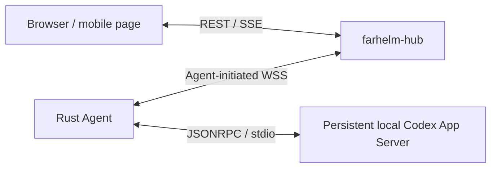

<div align="center">
  
  <h1>FarHelm</h1>
  <p><strong>A remote control plane for personal research and GPU training environments</strong></p>
  <p>See training-host status from your phone and safely extend remote control without exposing inbound ports on training machines.</p>
  <p>
    <a href="https://github.com/Xiiiing/FarHelm/releases/tag/V0.8.0">V0.8.0</a> ·
    <a href="./deploy/README.en.md">Deployment guide</a> ·
    <a href="./README.md">简体中文</a>
  </p>
</div>

> [!IMPORTANT]
> `V0.8.0` lets the Rust Agent manage your installed, authenticated Codex through one persistent App Server and an outbound WSS connection. The workspace uses Ant Design X, a shared memory cache, and virtualized history while preserving global navigation, experiments, schedules, and browser notifications.

## Quick install

Formal programs target Ubuntu 24.04 x86_64, or a compatible system with systemd and glibc 2.39+. The downloaded file is the actual program; no archive extraction is required.

### Hub

Run on the public server. The download can be kept under `/apps`:

```bash
cd /apps
curl -fL https://github.com/Xiiiing/FarHelm/releases/latest/download/farhelm-hub-linux-x86_64 -o farhelm-hub
chmod +x farhelm-hub
sudo ./farhelm-hub install
```

The program asks only for the administrator username and password. TOTP and shared Agent tokens are no longer generated. The installed program is `/usr/local/bin/farhelm-hub`; after signing in, use “Servers → Add server” to create a one-time eight-digit pairing code.

### Agent

Run as the target regular user on each training host; do not use sudo:

```bash
mkdir -p "$HOME/apps"
cd "$HOME/apps"
curl -fL https://github.com/Xiiiing/FarHelm/releases/latest/download/farhelm-agent-linux-x86_64 -o farhelm-agent
chmod +x farhelm-agent
./farhelm-agent install
```

The program asks only for the Hub HTTPS URL and the eight-digit code shown by the Console. It obtains a dedicated 256-bit token and stores it in a mode-`0600` configuration automatically. The installed program is `${XDG_BIN_HOME:-$HOME/.local/bin}/farhelm-agent`; the downloaded copy may be deleted after installation succeeds.

Agent reuses your existing Codex without downloading Python or a dedicated Codex runtime. Installation discovers a unique executable. If your terminal finds Codex but the service cannot (for example, with NVM), configure the path from that terminal:

```bash
codex --version
farhelm-agent codex configure --bin "$(command -v codex)"
farhelm-agent restart
farhelm-agent status
```

Codex 0.153.4 is the initial acceptance version; core protocol compatibility tests cover 0.147.0. FarHelm does not update your Codex or change its authentication, model, or global configuration. Experiment reporting still works when Codex is missing or unavailable. `status` separately reports the service, Hub connection, and Codex readiness.

See the [deployment guide](deploy/README.en.md) for non-interactive installation, Caddy, systemd, migration, and removal details.

## Daily operations

Hub and Agent each expose one user-facing program:

| Item | Hub | Agent |
| --- | --- | --- |
| Configuration | `/etc/farhelm/hub.toml` | `${XDG_CONFIG_HOME:-$HOME/.config}/farhelm/agent.toml` |
| Service | system-level systemd service | user-level systemd service |
| Privilege | use sudo | regular user, no sudo |
| Logs | `journalctl -u farhelm-hub` | `journalctl --user -u farhelm-agent` |

```bash
# Hub
sudo farhelm-hub doctor
sudo farhelm-hub status
sudo farhelm-hub restart
sudo farhelm-hub update --check
sudo farhelm-hub update
sudo farhelm-hub rollback
sudo farhelm-hub admin reset-password

# Agent
farhelm-agent doctor
farhelm-agent status
farhelm-agent restart
farhelm-agent update --check
farhelm-agent update
farhelm-agent rollback
farhelm-agent pair

# List old Codex sessions
farhelm-agent codex sessions --project cc08

# Register an existing training PID; prompts come only from a file or stdin
farhelm-agent experiment watch --project cc08 --pid 12345 \
  --session ses_xxx --log outputs/exp42/train.log \
  --on-success-prompt-file next-step.txt
farhelm-agent experiment list
```

If the current shell does not yet include `~/.local/bin`, temporarily use the complete path `~/.local/bin/farhelm-agent`. Updates verify the immutable Release, length, SHA-256, role, and version; activation failure automatically restores the local previous program.

## Training reports and notifications

Call once outside the training loop to report the whole batch. For one report per round, call inside the loop with a distinct `--run-id` each time:

```bash
farhelm-agent experiment report --project cc08 --run-id batch-20260907 \
  --name "8 rounds of training" --status succeeded --message "All training completed"

# Queue a follow-up only on success, in a session of the same project
farhelm-agent experiment report --project cc08 --run-id batch-with-followup \
  --name "8 rounds of training" --exit-code 0 --session ses_xxx \
  --on-success-prompt-file next-step.txt

# Read a custom message of at most 2 KiB from stdin
printf 'Training failed; sign in for details' | farhelm-agent experiment report \
  --project cc08 --name "Training result" --status failed --message -
```

A successful command returns `run_id`, `event_id`, and `stored_locally: true`: the Agent committed a local transaction. Reports can be saved with the Agent service stopped or Hub offline and are delivered when service resumes. Browser alert delivery is a separate step. Retrying identical content with the same Agent, project, and explicit run ID returns the original receipt; different content conflicts. Omitting the run ID creates a new record. Names allow 128 characters; results are succeeded, failed, or unknown, or a mutually exclusive exit code (0 means success).

The [Bash example](examples/experiment-report.sh) and [Python example](examples/experiment-report.py) report failures through exit handling and preserve the training exit code, without a Python SDK. A single final call cannot infer a result if never reached, after power loss, or after SIGKILL; use PID watch for that fallback. Success follow-ups expire after 24 hours; failed and unknown reports only notify. Prompt files remain on the Agent.

The notification center provides pagination, type/Agent/result filters, synchronized unread state, and details. Settings include system/light/dark themes, experiment/Codex in-page alert switches, and a browser test notification. Keep FarHelm open to receive completion alerts and click through to details. Initial loading and reconnect history do not trigger a burst of old alerts. This release covers browser in-page notifications; iOS system notifications are planned for a later version.

Browser commands and schedules are acknowledged after Agent persistence. Failed submissions retain the current-page draft and operation identity for retries. On restart, saved terminal receipts reconcile completed work; running tasks without a terminal receipt become orphaned and are not replayed. Upgrade Hub before Agent; the new content relay requires the Agent's V0.7 capability.

## Codex workspace

Desktop global navigation and mobile bottom navigation remain visible in Codex. Sessions collapse by project, with the device name beside each project; same-named projects on different devices remain separate. Sessions use formal names or a temporary first-user-message summary. Search covers all imported sessions in the selected scope; offline Agents are clearly marked as incomplete results. Summaries and search results never enter Hub databases, logs, or notification titles.

Assistant replies support Markdown tables, code copying, math, and safe HTTPS links. Execution details in each turn form a collapsed group with visible failures. The composer stays visible, and reading older content does not jump to the bottom on new messages. Large-message continuation is separate from loading earlier conversations. Switching sessions immediately displays cached history and retains each draft; failed refreshes preserve visible content. Inactive body and parsing caches total at most 32 MiB, with at most 20 inactive histories, and are cleared on logout. Steer and interrupt target the visible active turn.

The appearance uses neutral black, white, and gray surfaces. Settings offer separate light/dark mode and accent choices (graphite, blue, green, violet, rose, orange, or a custom color), applied immediately and saved in the current browser. The rounded composer stays visible; locally served Manrope and Noto Sans SC fonts share a consistent reading column. Submission and expanding execution details use brief animations that respect the system’s reduced-motion preference; cached session switches do not replay the entry animation.

Upgrade Hub before Agent when moving from V0.7.1. SQLite schema remains 7. Older Agents retain HTTP compatibility; upgraded Agents use WSS without also claiming work over HTTP. Existing Python directories remain on installed machines for rollback validation and are never invoked by the new version.

## What is implemented

- `farhelm-hub`: Rust control plane with password login, SQLite-backed 30-day sessions, short-code pairing, Secure HttpOnly cookies, CSRF, login throttling, reliable events, SSE replay, and Web Push.
- `farhelm-agent`: regular-user outbound operation, automatic Codex project discovery, a local approval registry, explicit PID watches, PID-reuse protection, SQLite inbox/outbox, and isolated worktrees.
- `farhelm-console`: React, TypeScript, Ant Design / Ant Design X, TanStack Query / Virtual, and Vite PWA with mobile/desktop experiment and Codex views, streamed replies, and notification deep-link handling.

All remote actions are fixed typed operations; action, cwd, argv, environment, and shell text are never accepted. Training is still started and stopped through the user's existing workflow.

## Architecture



FarHelm is one monorepo, but Hub and Agent are compiled separately and retain distinct privileges and attack surfaces. Codex communicates only over local stdio. Authentication remains local; Hub relays bodies only in bounded memory for at most 20 seconds.

The Codex composer displays the session model, reasoning effort, and permission details returned by the server. Resuming inherits native Codex settings; new browser sessions use project configuration, with an optional isolated Git worktree. Unconfirmed settings are marked unknown rather than inferred from legacy session modes. Adjust the model and permissions in Codex on the server. Browser approval prompts are not supported yet, so operations requiring user approval are declined. Upgrade Hub before Agent and verify that Agent advertises `codex.session_context`. Explicit inspect/edit creation through older APIs and the CLI remains compatible.

## Local development

You need Rust 1.98, Node.js 24, Corepack, and a locally installed Codex.

```bash
corepack pnpm@10.17.1 --dir farhelm-console install
corepack pnpm@10.17.1 --dir farhelm-console build
cargo run -p farhelm-hub -- serve --config /path/to/hub.toml
```

Example configuration lives at `farhelm-hub/hub.example.toml` and `farhelm-agent/agent.example.toml`.

Run the complete checks with:

```bash
make check
make test
make privacy
make test-ui
make test-release
```

## Security and version policy

- Agent needs no root access and opens no public inbound port. Hub binds only to loopback and is exposed through Caddy or an equivalent HTTPS reverse proxy.
- Administrator passwords use Argon2id. Hub stores only hashes of browser-session and Agent tokens; the raw Agent token crosses the network once in the pairing response.
- Hub does not store Codex login credentials, SSH private keys, project source, or complete local logs.
- Native Codex communicates with Agent only over stdin/stdout. Mutations require allowlists, TTLs, idempotency, and auditing. Execution is serial within a session, with at most four active turns across sessions.
- Versions use `MAJOR.MINOR.PATCH`: only the user may decide the first number; features increase the second, and fixes increase the third.
- GitHub Releases retain only the latest formal version; historical Git tags remain and are never reused. Online update moves only to the latest version, while downgrade uses the machine-local previous program.

## Roadmap

1. Expand upgrade acceptance across additional hosts and Codex versions.
2. Develop the iOS client, system notifications, and real-device background validation.
3. Evaluate GPU metrics and TensorBoard from real experiment needs, without adding remote training control.

## License

FarHelm is licensed under the [Apache License 2.0](LICENSE).

Direct UI and cache dependencies use fixed versions; see the [third-party notices](farhelm-console/public/third-party-notices.txt).
