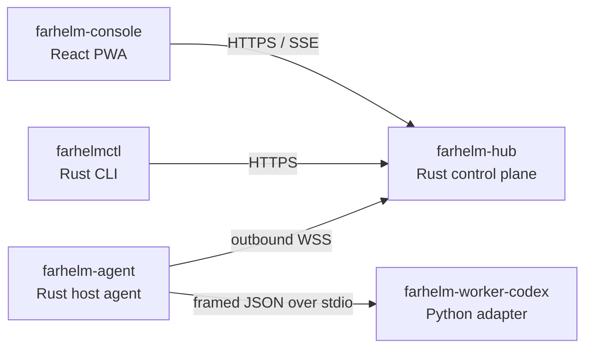

# FarHelm

[简体中文](README.md) · [English](README.en.md)

FarHelm is a remote control plane for personal research and GPU training environments. It brings server health, training jobs, and Codex sessions from multiple machines into one mobile-first web console while keeping training hosts outbound-only and retaining source code and credentials locally.

> Current status: `0.1.0` project skeleton. The repository currently provides component boundaries, a health endpoint, an Agent-to-Worker handshake, and a responsive console shell. Authentication, training control, remote Codex sessions, and Web Push are not implemented yet.

## Architecture



FarHelm is one product in one monorepo, while each runtime role retains least privilege and an independent deliverable:

| Component | Responsibility | Stack |
| --- | --- | --- |
| `farhelm-hub` | Public API, state, and control plane | Rust, Axum, Tokio |
| `farhelm-agent` | Host state, jobs, and Worker supervision | Rust, Tokio |
| `farhelm-console` | Mobile and desktop console | React, TypeScript, Ant Design, Vite PWA |
| `farhelm-worker-codex` | Isolated Codex SDK adapter | Python 3.12, uv |
| `farhelmctl` | Installation, diagnostics, and management | Rust, Clap |

Shared Rust types live under `crates/`. Hub and Agent are compiled separately, the Worker does not listen on a network socket, and the Console proxies to Hub during development.

## Quick start

You need Rust 1.98, Node.js 24, Corepack, Python 3.12, and [uv](https://docs.astral.sh/uv/).

```bash
corepack pnpm@10.17.1 --dir farhelm-console install
uv sync --project farhelm-worker-codex --all-groups
```

Start Hub:

```bash
cargo run -p farhelm-hub
```

Start Console in another terminal:

```bash
corepack pnpm@10.17.1 --dir farhelm-console dev
```

Open `http://127.0.0.1:5173`. Hub exposes its health endpoint at `http://127.0.0.1:8787/api/v1/health`.

Verify the CLI and Worker:

```bash
cargo run -p farhelmctl -- health
cargo run -p farhelm-agent -- worker-smoke
```

## Development checks

```bash
make check
make test
make privacy
```

Each ecosystem can also be tested independently:

```bash
cargo test --workspace
corepack pnpm@10.17.1 --dir farhelm-console test
uv run --project farhelm-worker-codex pytest
```

## Security boundaries

- Training hosts do not need new public inbound ports.
- Hub does not store Codex login credentials, SSH private keys, or project source code.
- Worker communicates with Agent only over stdin/stdout and exposes no network service.
- The first release does not expose an arbitrary remote shell; future mutations require allowlists, TTLs, idempotency, and auditing.
- Example configuration must never include real credentials or private server paths.

## Roadmap

1. Stabilize the Agent–Worker protocol and validate the Codex SDK lifecycle.
2. Complete the single-host Hub and PWA session loop.
3. Add replay, idempotency, worktree isolation, and reviewable diffs.
4. Add GPU and training-job metrics, logs, and notifications.
5. Expand to multiple hosts and validate atomic upgrades and rollback.

## License

FarHelm is licensed under the [Apache License 2.0](LICENSE).
