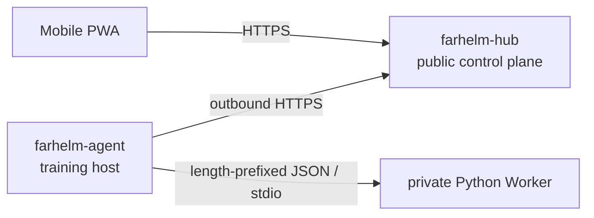

<div align="center">
  
  <h1>FarHelm</h1>
  <p><strong>A remote control plane for personal research and GPU training environments</strong></p>
  <p>See training-host status from your phone and safely extend remote control without exposing inbound ports on training machines.</p>
  <p>
    <a href="https://github.com/Xiiiing/FarHelm/releases/tag/V0.6.0">V0.6.0</a> ·
    <a href="./deploy/README.en.md">Deployment guide</a> ·
    <a href="./README.md">简体中文</a>
  </p>
</div>

> [!IMPORTANT]
> The current `V0.6.0` release adds an immersive Codex workspace, paginated complete conversations, one-time scheduling, experiment-success triggers, and shorter session-sync and streaming paths. Codex content remains on the Agent. It still does not provide remote training control, automatic training-process discovery, GPU/TensorBoard charts, or arbitrary shell execution.

## Quick install

Formal programs target Ubuntu 24.04 x86_64, or a compatible system with systemd and glibc 2.39+. The downloaded file is the actual program; no archive extraction is required.

### Hub

Run on the public server. The download can be kept under `/apps`:

```bash
cd /apps
curl -fL https://github.com/Xiiiing/FarHelm/releases/latest/download/farhelm-hub-linux-x86_64 -o farhelm-hub
chmod +x farhelm-hub
sudo ./farhelm-hub install
```

The program asks only for the administrator username and password. TOTP and shared Agent tokens are no longer generated. The installed program is `/usr/local/bin/farhelm-hub`; after signing in, use “Servers → Add server” to create a one-time eight-digit pairing code.

### Agent

Run as the target regular user on each training host; do not use sudo:

```bash
mkdir -p "$HOME/apps"
cd "$HOME/apps"
curl -fL https://github.com/Xiiiing/FarHelm/releases/latest/download/farhelm-agent-linux-x86_64 -o farhelm-agent
chmod +x farhelm-agent
./farhelm-agent install
```

The program asks only for the Hub HTTPS URL and the eight-digit code shown by the Console. It obtains a dedicated 256-bit token and stores it in a mode-`0600` configuration automatically. The installed program is `${XDG_BIN_HOME:-$HOME/.local/bin}/farhelm-agent`; the downloaded copy may be deleted after installation succeeds.

See the [deployment guide](deploy/README.en.md) for non-interactive installation, Caddy, systemd, migration, and removal details.

## Daily operations

Hub and Agent each expose one user-facing program:

| Item | Hub | Agent |
| --- | --- | --- |
| Configuration | `/etc/farhelm/hub.toml` | `${XDG_CONFIG_HOME:-$HOME/.config}/farhelm/agent.toml` |
| Service | system-level systemd service | user-level systemd service |
| Privilege | use sudo | regular user, no sudo |
| Logs | `journalctl -u farhelm-hub` | `journalctl --user -u farhelm-agent` |

```bash
# Hub
sudo farhelm-hub doctor
sudo farhelm-hub status
sudo farhelm-hub restart
sudo farhelm-hub update --check
sudo farhelm-hub update
sudo farhelm-hub rollback
sudo farhelm-hub admin reset-password

# Agent
farhelm-agent doctor
farhelm-agent status
farhelm-agent restart
farhelm-agent update --check
farhelm-agent update
farhelm-agent rollback
farhelm-agent pair

# List old Codex sessions
farhelm-agent codex sessions --project cc08

# Register an existing training PID; prompts come only from a file or stdin
farhelm-agent experiment watch --project cc08 --pid 12345 \
  --session ses_xxx --log outputs/exp42/train.log \
  --on-success-prompt-file next-step.txt
farhelm-agent experiment list
```

If the current shell does not yet include `~/.local/bin`, temporarily use the complete path `~/.local/bin/farhelm-agent`. Updates verify the immutable Release, length, SHA-256, role, and version; activation failure automatically restores the local previous program.

## What is implemented

- `farhelm-hub`: Rust control plane with password login, SQLite-backed 30-day sessions, short-code pairing, Secure HttpOnly cookies, CSRF, login throttling, reliable events, SSE replay, and Web Push.
- `farhelm-agent`: regular-user outbound operation, automatic Codex project discovery, a local approval registry, explicit PID watches, PID-reuse protection, SQLite inbox/outbox, and isolated worktrees.
- `farhelm-console`: React, TypeScript, Ant Design, and Vite PWA with mobile/desktop experiment and Codex views, streamed replies, and notification deep-link handling.
- `farhelm-worker-codex`: Agent-private Python stdio adapter pinned to `openai-codex==0.147.0`, covering thread list/start/resume and turn start/steer/interrupt.

All remote actions are fixed typed operations; action, cwd, argv, environment, and shell text are never accepted. Training is still started and stopped through the user's existing workflow.

## Architecture



FarHelm is one monorepo, but Hub and Agent are compiled separately and retain distinct privileges and attack surfaces. Worker exposes no network socket and never receives the Hub token.

## Local development

You need Rust 1.98, Node.js 24, Corepack, Python 3.12, and [uv](https://docs.astral.sh/uv/).

```bash
corepack pnpm@10.17.1 --dir farhelm-console install
uv sync --project farhelm-worker-codex --all-groups
corepack pnpm@10.17.1 --dir farhelm-console build
cargo run -p farhelm-hub -- serve --config /path/to/hub.toml
```

Example configuration lives at `farhelm-hub/hub.example.toml` and `farhelm-agent/agent.example.toml`.

Run the complete checks with:

```bash
make check
make test
make privacy
make test-ui
make test-release
```

## Security and version policy

- Agent needs no root access and opens no public inbound port. Hub binds only to loopback and is exposed through Caddy or an equivalent HTTPS reverse proxy.
- Administrator passwords use Argon2id. Hub stores only hashes of browser-session and Agent tokens; the raw Agent token crosses the network once in the pairing response.
- Hub does not store Codex login credentials, SSH private keys, project source, or complete local logs.
- Worker communicates with Agent only over stdin/stdout. Mutations require allowlists, TTLs, idempotency, and auditing.
- Versions use `MAJOR.MINOR.PATCH`: only the user may decide the first number; features increase the second, and fixes increase the third.
- GitHub Releases retain only the latest formal version; historical Git tags remain and are never reused. Online update moves only to the latest version, while downgrade uses the machine-local previous program.

## Roadmap

1. Complete the V0.5 zero-configuration canary on A6000/CC08, Titan/work831, and 3090/work832.
2. Production-validate background Web Push from the iPhone home-screen PWA.
3. Evaluate GPU metrics and TensorBoard from real experiment needs, without adding remote training control.

## License

FarHelm is licensed under the [Apache License 2.0](LICENSE).
