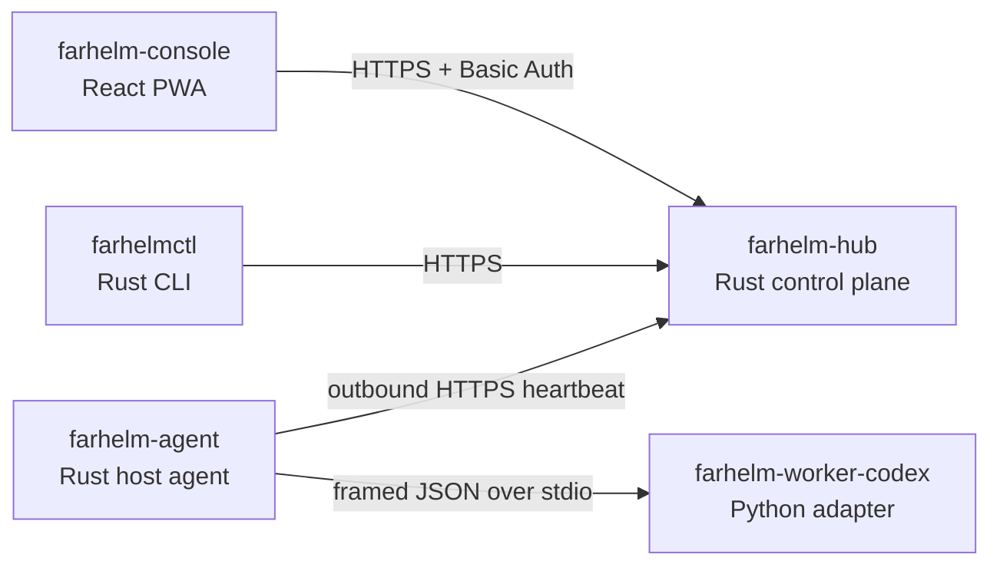

# FarHelm

[简体中文](README.md) · [English](README.en.md)

FarHelm is a remote control plane for personal research and GPU training environments. It brings server health, training jobs, and Codex sessions from multiple machines into one mobile-first web console while keeping training hosts outbound-only and retaining source code and credentials locally.

> Current status: `0.1.0` minimal deployment. The public Hub serves Console behind separate admin authentication, while training-host Agents use a separate token to report real presence outbound. Training control, remote Codex sessions, and Web Push are not implemented yet.

## Architecture



FarHelm is one product in one monorepo, while each runtime role retains least privilege and an independent deliverable:

| Component | Responsibility | Stack |
| --- | --- | --- |
| `farhelm-hub` | Public API, state, and control plane | Rust, Axum, Tokio |
| `farhelm-agent` | Host state, jobs, and Worker supervision | Rust, Tokio |
| `farhelm-console` | Mobile and desktop console | React, TypeScript, Ant Design, Vite PWA |
| `farhelm-worker-codex` | Isolated Codex SDK adapter | Python 3.12, uv |
| `farhelmctl` | Installation, diagnostics, and management | Rust, Clap |

Shared Rust types live under `crates/`. Hub and Agent are compiled separately and the Worker does not listen on a network socket. A deployment bundle lets Hub serve Console; Vite still proxies to Hub during development.

## Quick start

You need Rust 1.98, Node.js 24, Corepack, Python 3.12, and [uv](https://docs.astral.sh/uv/).

```bash
corepack pnpm@10.17.1 --dir farhelm-console install
uv sync --project farhelm-worker-codex --all-groups
```

Build Console and start Hub with loopback-only test credentials:

```bash
corepack pnpm@10.17.1 --dir farhelm-console build
FARHELM_ADMIN_USER=admin \
FARHELM_ADMIN_PASSWORD=local-password-1234 \
FARHELM_AGENT_TOKEN=local-agent-token-with-at-least-32-characters \
FARHELM_CONSOLE_DIR=farhelm-console/dist \
cargo run -p farhelm-hub
```

Start Console in another terminal:

```bash
corepack pnpm@10.17.1 --dir farhelm-console dev
```

Open `http://127.0.0.1:5173`. Hub exposes its health endpoint at `http://127.0.0.1:8787/api/v1/health`.

Verify the CLI and Worker:

```bash
cargo run -p farhelmctl -- health
cargo run -p farhelm-agent -- worker-smoke
```

Send one local Agent heartbeat:

```bash
FARHELM_HUB_URL=http://127.0.0.1:8787 \
FARHELM_AGENT_TOKEN=local-agent-token-with-at-least-32-characters \
FARHELM_AGENT_ID=gpu-a \
cargo run -p farhelm-agent -- heartbeat
```

## Deployment bundles

Build two installable Linux x86_64 bundles. The current binary target is Ubuntu 24.04 x86_64 or a compatible glibc 2.39+ system:

```bash
make release
make test-release
```

Artifacts are written to `dist/release/`: use `farhelm-hub-0.1.0-linux-x86_64.tar.gz` on the public server and `farhelm-agent-0.1.0-linux-x86_64.tar.gz` on the training server. See the complete systemd, Caddy, and installation instructions in the [deployment guide](deploy/README.en.md). Hub must remain on loopback and be exposed only through an HTTPS reverse proxy.

## Development checks

```bash
make check
make test
make privacy
```

Each ecosystem can also be tested independently:

```bash
cargo test --workspace
corepack pnpm@10.17.1 --dir farhelm-console test
uv run --project farhelm-worker-codex pytest
```

## Security boundaries

- Training hosts do not need new public inbound ports.
- Hub rejects non-loopback binds; Caddy or an equivalent reverse proxy terminates public TLS.
- Admin credentials and the Agent token are independent and stored in permission-restricted `/etc/farhelm/*.env` files.
- Hub does not store Codex login credentials, SSH private keys, or project source code.
- Worker communicates with Agent only over stdin/stdout and exposes no network service.
- The first release does not expose an arbitrary remote shell; future mutations require allowlists, TTLs, idempotency, and auditing.
- Example configuration must never include real credentials or private server paths.

## Roadmap

1. Design an Agent–Hub command channel with a durable outbox, idempotency, and recovery semantics.
2. Stabilize the Agent–Worker protocol and validate the Codex SDK lifecycle.
3. Complete training-job and Codex session flows for one training host.
4. Add GPU and training-job metrics, logs, and notifications.
5. Expand to multiple hosts and validate atomic upgrades and rollback.

## License

FarHelm is licensed under the [Apache License 2.0](LICENSE).
