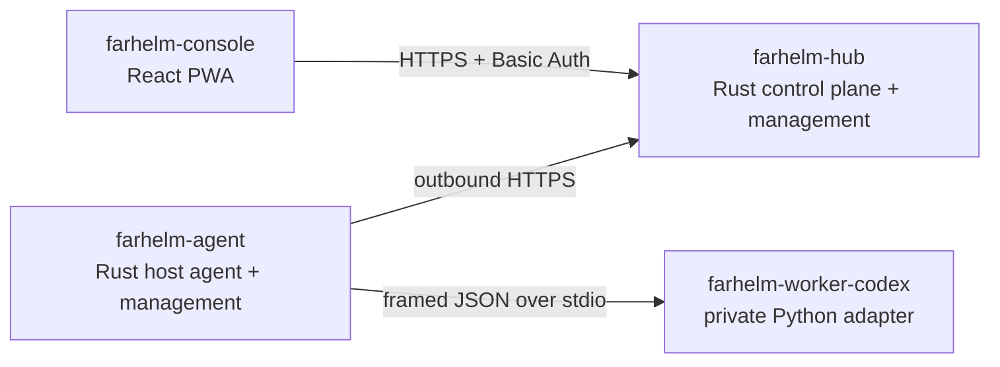

# FarHelm

[简体中文](README.md) · [English](README.en.md)

FarHelm is a remote control plane for personal research and GPU training environments. It brings server health, training jobs, and Codex sessions from multiple machines into one mobile-first web console while keeping training hosts outbound-only and retaining source code and credentials locally.

> Current status: `V0.3.0`, the native role-program release. Each download is the actual Hub or Agent, not a bootstrap that expands the old installer. The corresponding program now owns installation, configuration checks, service start/stop/restart/status, updates, rollback, and removal. The only enabled action remains the side-effect-free `agent.probe`.

## Architecture



FarHelm is one product in one monorepo, while Hub and Agent retain separate permissions and attack surfaces:

| Component | Responsibility | Stack |
| --- | --- | --- |
| `farhelm-hub` | Public API, embedded Console, state, service, and update management | Rust, Axum, Tokio |
| `farhelm-agent` | Host state, jobs, Worker, service, and update management | Rust, Tokio |
| `farhelm-console` | Mobile and desktop console, embedded into formal Hub builds | React, TypeScript, Ant Design, Vite PWA |
| `farhelm-worker-codex` | Agent-private isolated Codex SDK adapter | Python 3.12, uv |

Shared Rust types live under `crates/`. Worker exposes no network socket and never receives the Hub token.

## Development quick start

You need Rust 1.98, Node.js 24, Corepack, Python 3.12, and [uv](https://docs.astral.sh/uv/).

```bash
corepack pnpm@10.17.1 --dir farhelm-console install
uv sync --project farhelm-worker-codex --all-groups
```

Copy `farhelm-hub/hub.example.toml`, point `hub.console_dir` at `farhelm-console/dist`, then start Hub:

```bash
corepack pnpm@10.17.1 --dir farhelm-console build
cargo run -p farhelm-hub -- serve --config /path/to/hub.toml
```

Check Hub and Worker:

```bash
cargo run -p farhelm-hub -- health
cargo run -p farhelm-agent -- worker-smoke
```

Send one local Agent heartbeat:

```bash
cargo run -p farhelm-agent -- heartbeat --config /path/to/agent.toml
```

## Download and install

Formal binaries target Ubuntu 24.04 x86_64, or a compatible system with systemd and glibc 2.39+. Install Hub with:

```bash
curl -fL https://github.com/Xiiiing/FarHelm/releases/latest/download/farhelm-hub-linux-x86_64 -o farhelm-hub
chmod +x farhelm-hub
sudo ./farhelm-hub install
```

Install Agent as the regular training-host user, without sudo:

```bash
curl -fL https://github.com/Xiiiing/FarHelm/releases/latest/download/farhelm-agent-linux-x86_64 -o farhelm-agent
chmod +x farhelm-agent
./farhelm-agent install
```

The programs prompt for required values when configuration is missing. Automation may still provide `FARHELM_ADMIN_USER`, `FARHELM_ADMIN_PASSWORD`, `FARHELM_AGENT_TOKEN`, `FARHELM_HUB_URL`, and `FARHELM_AGENT_ID` as environment variables; do not put secrets in command-line arguments.

All installed operations use the same role program:

```bash
sudo farhelm-hub status
sudo farhelm-hub restart
sudo farhelm-hub update --check
sudo farhelm-hub update
sudo farhelm-hub rollback

farhelm-agent status
farhelm-agent restart
farhelm-agent update --check
farhelm-agent update
farhelm-agent rollback
```

Configuration lives at:

- Hub: `/etc/farhelm/hub.toml`
- Agent: `${XDG_CONFIG_HOME:-$HOME/.config}/farhelm/agent.toml`

See the [deployment guide](deploy/README.en.md) for executable, configuration, database, systemd, complete removal, and Caddy paths. Hub must stay on loopback and be exposed through Caddy or an equivalent HTTPS reverse proxy.

## Development checks

```bash
make check
make test
make privacy
make test-ui
make test-release
```

## Security boundaries

- Training hosts expose no new public inbound ports, and Agent needs no root access.
- Hub rejects non-loopback binds; a reverse proxy terminates public TLS.
- Admin credentials and Agent tokens are independent and stored in permission-restricted TOML configuration.
- Hub does not store Codex login credentials, SSH private keys, or project source.
- Worker communicates with Agent only over stdin/stdout.
- FarHelm exposes no arbitrary remote shell; mutations require allowlists, TTLs, idempotency, and auditing.
- Self-update accepts only versioned actual executables from immutable uppercase `V*` Releases in the fixed official repository; crossing the first version number requires explicit user permission.
- `V0.3.0` retains a one-time compatibility archive so the uppercase formal V0.2.0 release can migrate. New installs and later updates do not expose archive directories.

## Roadmap

1. Add WSS wakeups and an Agent event outbox.
2. Validate the production Codex SDK lifecycle and extend the Worker protocol.
3. Complete training-job and Codex session flows for one host.
4. Add GPU/training metrics, logs, and Web Push notifications.
5. Expand to multiple hosts and validate canary updates.

## License

FarHelm is licensed under the [Apache License 2.0](LICENSE).
