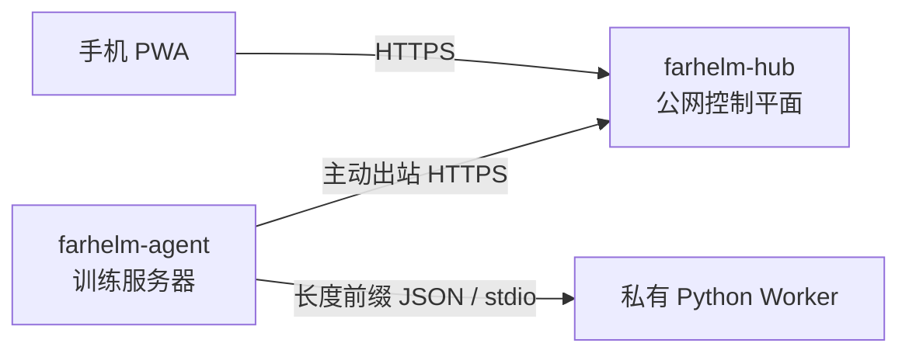

<div align="center">
  
  <h1>FarHelm</h1>
  <p><strong>面向个人科研与 GPU 训练环境的远程控制平面</strong></p>
  <p>从手机查看训练服务器状态，并在不开放训练机入站端口的前提下安全扩展远程控制能力。</p>
  <p>
    <a href="https://github.com/Xiiiing/FarHelm/releases/tag/V0.3.0">V0.3.0</a> ·
    <a href="./deploy/README.md">部署文档</a> ·
    <a href="./README.en.md">English</a>
  </p>
</div>

> [!IMPORTANT]
> 当前 `V0.3.0` 已提供 Hub 健康检查、Agent 心跳与列表、可靠命令状态和无副作用的 `agent.probe`。GPU 指标、训练控制、Codex 会话和 Web Push 仍在路线图中，README 不把规划能力描述成已完成能力。

## 快速安装

正式程序面向 Ubuntu 24.04 x86_64，或带 systemd、glibc 2.39+ 的兼容系统。下载文件就是实际程序，不需要解压安装包。

### Hub

在公网服务器上执行。下载文件可以放在 `/apps`：

```bash
cd /apps
curl -fL https://github.com/Xiiiing/FarHelm/releases/latest/download/farhelm-hub-linux-x86_64 -o farhelm-hub
chmod +x farhelm-hub
sudo ./farhelm-hub install
```

程序会交互询问管理员用户名、管理员密码和 Agent token。安装后的实际程序位于 `/usr/local/bin/farhelm-hub`。

### Agent

在训练服务器上使用目标普通用户执行，不要使用 sudo：

```bash
mkdir -p "$HOME/apps"
cd "$HOME/apps"
curl -fL https://github.com/Xiiiing/FarHelm/releases/latest/download/farhelm-agent-linux-x86_64 -o farhelm-agent
chmod +x farhelm-agent
./farhelm-agent install
```

程序会询问 Hub HTTPS 地址、Agent token 和 Agent ID。安装后的实际程序位于 `${XDG_BIN_HOME:-$HOME/.local/bin}/farhelm-agent`；成功后可以删除下载副本。

更完整的非交互安装、Caddy、systemd、迁移和卸载说明见[部署文档](deploy/README.md)。

## 日常使用

Hub 与 Agent 各自只有一个面向用户的程序入口：

| 项目 | Hub | Agent |
| --- | --- | --- |
| 配置 | `/etc/farhelm/hub.toml` | `${XDG_CONFIG_HOME:-$HOME/.config}/farhelm/agent.toml` |
| 服务 | systemd 系统服务 | systemd 用户服务 |
| 权限 | 使用 sudo | 普通用户，不使用 sudo |
| 日志 | `journalctl -u farhelm-hub` | `journalctl --user -u farhelm-agent` |

```bash
# Hub
sudo farhelm-hub doctor
sudo farhelm-hub status
sudo farhelm-hub restart
sudo farhelm-hub update --check
sudo farhelm-hub update
sudo farhelm-hub rollback

# Agent
farhelm-agent doctor
farhelm-agent status
farhelm-agent restart
farhelm-agent update --check
farhelm-agent update
farhelm-agent rollback
```

如果当前 shell 尚未包含 `~/.local/bin`，暂时使用完整路径 `~/.local/bin/farhelm-agent`。升级会验证不可变 Release、长度、SHA-256、角色和版本；激活失败会自动恢复本地 previous。

## 当前实现

- `farhelm-hub`：Rust 控制平面、Basic Auth、内嵌 Console、SQLite 命令事实源和服务生命周期。
- `farhelm-agent`：普通用户运行、只主动连接 Hub、心跳、命令 claim/report、本地幂等状态和服务生命周期。
- `farhelm-console`：React、TypeScript、Ant Design、Vite PWA；正式构建内嵌到 Hub。
- `farhelm-worker-codex`：Agent 私有的 Python stdio 适配层；当前仅验证协议握手，尚未连接真实 Codex 生命周期。

当前远程动作只允许无副作用的 `agent.probe`，不提供任意远程 shell，也不能远程启动或停止训练。

## 架构



FarHelm 是一个 monorepo，但 Hub 与 Agent 分离编译并保持不同权限与攻击面。Worker 不监听网络，也不持有 Hub token。

## 本地开发

需要 Rust 1.98、Node.js 24、Corepack、Python 3.12 和 [uv](https://docs.astral.sh/uv/)。

```bash
corepack pnpm@10.17.1 --dir farhelm-console install
uv sync --project farhelm-worker-codex --all-groups
corepack pnpm@10.17.1 --dir farhelm-console build
cargo run -p farhelm-hub -- serve --config /path/to/hub.toml
```

示例配置位于 `farhelm-hub/hub.example.toml` 和 `farhelm-agent/agent.example.toml`。

完整检查：

```bash
make check
make test
make privacy
make test-ui
make test-release
```

## 安全与版本规则

- Agent 不需要 root，也不开放公网入站端口；Hub 只监听 loopback，由 Caddy 或等价 HTTPS 反向代理公开。
- 管理员凭据与 Agent token 相互独立，并保存在受限权限的 TOML 配置中。
- Hub 不保存 Codex 登录凭据、SSH 私钥、项目源码或完整本地日志。
- Worker 只通过 stdin/stdout 与 Agent 通信；写操作必须经过白名单、TTL、幂等和审计。
- 版本使用 `MAJOR.MINOR.PATCH`：第一段只能由用户决定，功能提升第二段，纯修复提升第三段。
- GitHub Releases 只保留最新正式版本；历史 Git 标签保留但不复用。在线更新只升级到最新版本，降级只使用本机 previous。

## 路线图

1. 加入 WSS 唤醒和 Agent 事件 outbox。
2. 验证正式 Codex SDK 生命周期并扩展 Worker 协议。
3. 完成单台训练服务器的训练任务与 Codex 会话闭环。
4. 加入 GPU、训练指标、日志和 Web Push 通知。
5. 扩展到多服务器并验证 canary 升级。

## 许可证

FarHelm 使用 [Apache License 2.0](LICENSE)。
