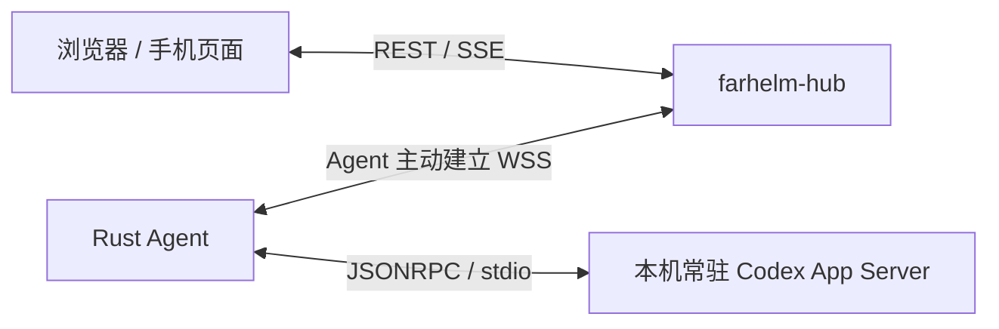

<div align="center">
  
  <h1>FarHelm</h1>
  <p><strong>面向个人科研与 GPU 训练环境的远程控制平面</strong></p>
  <p>从手机查看训练服务器状态，并在不开放训练机入站端口的前提下安全扩展远程控制能力。</p>
  <p>
    <a href="https://github.com/Xiiiing/FarHelm/releases/tag/V0.12.1">V0.12.1</a> ·
    <a href="./deploy/README.md">部署文档</a> ·
    <a href="./README.en.md">English</a>
  </p>
</div>

> [!IMPORTANT]
> `V0.12.1` 把服务器端 Codex 的原生队列、审批与问答、计划／审查／目标、Skills、图片、分组、历史操作和临时任务接入现有远程工作区。已有安装先升级 Hub，再升级各 Agent；本版迁移至 schema 9，升级程序会阻止不兼容的自动回退。

## 原生 Codex 远程控制（V0.12.1）

主输入区支持 Skills、图片上传与粘贴。对话可查看命令输出、文件 diff 和审查结果。原生队列结果不确定时保留对账状态，禁止自动重发。临时任务的内存历史有容量上限，结束后不可恢复；原生取消订阅后的卸载遵循 Codex 的宽限期。Codex 0.153.4 的临时任务不支持原生队列，可使用普通文字轮次。原生置顶需要服务器 Codex 返回 `isPinned` 能力（0.153.4 未提供）；不再通过分组名称模拟置顶。

- FarHelm 继续只负责远程输入、审批和展示；Codex、工具、文件与 Skills 均在所选 Agent 上运行。
- 网页与原生客户端共享 Codex 队列和任务状态，并支持运行中审批、问答、目标、审查、设置与历史操作。
- Skills 和服务器图片路径不会暴露给浏览器；图片使用受限分片上传，支持 PNG、JPEG、WebP，每次最多四张、每张最多 20 MiB。
- schema 8 会原地迁移到 schema 9；数据库升级后，低于 V0.12.0 的二进制不会被自动恢复。

## 快速安装

正式程序面向 Ubuntu 24.04 x86_64，或带 systemd、glibc 2.39+ 的兼容系统。下载文件就是实际程序，不需要解压安装包。

### Hub

在公网服务器上执行。下载文件可以放在 `/apps`：

```bash
cd /apps
curl -fL https://github.com/Xiiiing/FarHelm/releases/latest/download/farhelm-hub-linux-x86_64 -o farhelm-hub
chmod +x farhelm-hub
sudo ./farhelm-hub install
```

程序只询问管理员用户名和密码，不再要求 TOTP，也不会生成共享 Agent Token。安装后的实际程序位于 `/usr/local/bin/farhelm-hub`；登录网页后在“服务器 → 添加服务器”生成一次性 8 位配对码。

### Agent

在训练服务器上使用目标普通用户执行，不要使用 sudo：

```bash
mkdir -p "$HOME/apps"
cd "$HOME/apps"
curl -fL https://github.com/Xiiiing/FarHelm/releases/latest/download/farhelm-agent-linux-x86_64 -o farhelm-agent
chmod +x farhelm-agent
./farhelm-agent install
```

程序只询问 Hub HTTPS 地址和网页生成的 8 位配对码，独立 256-bit Token 会自动领取并写入 `0600` 配置。安装后的实际程序位于 `${XDG_BIN_HOME:-$HOME/.local/bin}/farhelm-agent`；成功后可以删除下载副本。

Agent 复用已有 Codex，不下载 Python 或独立 Codex runtime。安装时自动发现唯一可用程序；如果终端能运行 Codex 而服务找不到（例如 NVM 安装），在该终端明确配置：

```bash
codex --version
farhelm-agent codex configure --bin "$(command -v codex)"
farhelm-agent restart
farhelm-agent status
```

首个验收版本为 Codex 0.153.4，核心协议兼容测试覆盖 0.147.0。FarHelm 不更新用户 Codex，不修改其登录、模型或全局配置。未安装或未就绪时实验上报仍可运行；`status` 分别显示服务、Hub 连接和 Codex 状态。

更完整的非交互安装、Caddy、systemd、迁移和卸载说明见[部署文档](deploy/README.md)。

## 日常使用

Hub 与 Agent 各自只有一个面向用户的程序入口：

| 项目 | Hub | Agent |
| --- | --- | --- |
| 配置 | `/etc/farhelm/hub.toml` | `${XDG_CONFIG_HOME:-$HOME/.config}/farhelm/agent.toml` |
| 服务 | systemd 系统服务 | systemd 用户服务 |
| 权限 | 使用 sudo | 普通用户，不使用 sudo |
| 日志 | `journalctl -u farhelm-hub` | `journalctl --user -u farhelm-agent` |

```bash
# Hub
sudo farhelm-hub doctor
sudo farhelm-hub status
sudo farhelm-hub restart
sudo farhelm-hub update --check
sudo farhelm-hub update
sudo farhelm-hub rollback
sudo farhelm-hub admin reset-password

# Agent
farhelm-agent doctor
farhelm-agent status
farhelm-agent restart
farhelm-agent update --check
farhelm-agent update
farhelm-agent rollback
farhelm-agent pair

# 查看旧 Codex 会话
farhelm-agent codex sessions --project cc08

# 登记现有训练 PID；prompt 只从文件或 stdin 读取
farhelm-agent experiment watch --project cc08 --pid 12345 \
  --session ses_xxx --log outputs/exp42/train.log \
  --on-success-prompt-file next-step.txt
farhelm-agent experiment list
```

如果当前 shell 尚未包含 `~/.local/bin`，暂时使用完整路径 `~/.local/bin/farhelm-agent`。升级会验证不可变 Release、长度、SHA-256、角色和版本；激活失败会自动恢复本地 previous。

## 训练结束上报与通知

在训练循环外调用一次，记录整批结果；每轮记录请把调用放到循环内，并给每轮不同的 `--run-id`：

```bash
farhelm-agent experiment report --project cc08 --run-id batch-20260907 \
  --name "8 轮训练" --status succeeded --message "全部训练完成"

# 只在成功时向同项目的会话排队；指令文件只在 Agent 本地读取
farhelm-agent experiment report --project cc08 --run-id batch-with-followup \
  --name "8 轮训练" --exit-code 0 --session ses_xxx \
  --on-success-prompt-file next-step.txt

# 从 stdin 读取最多 2 KiB 的自定义消息
printf '训练失败，请登录查看详情' | farhelm-agent experiment report \
  --project cc08 --name "训练结果" --status failed --message -
```

成功返回 `run_id`、`event_id` 和 `stored_locally: true`，表示 Agent 本地事务已提交。Agent 服务停止或 Hub 断网时也可保存，服务恢复后补发；浏览器页面收到提醒是后续独立步骤。同 Agent、项目和显式 run ID 的相同内容重试返回原收据，内容改变则冲突。省略 run ID 会创建新记录。名称最多 128 字符；结果支持 succeeded、failed、unknown，或互斥的退出码（0 成功）。

[Bash 示例](examples/experiment-report.sh)和 [Python 示例](examples/experiment-report.py)通过退出捕获报告失败，保留训练退出码，不要求安装 Python SDK。脚本未运行到上报、机器断电或 SIGKILL 无法由单次上报推断结果，仍可使用 PID watch 兜底。成功续话有效期 24 小时，失败与 unknown 只通知。

通知中心支持分页、类型/Agent/结果筛选、未读同步和结果详情。通知、实验、审计刷新保留已加载页；筛选覆盖全部登记服务器，过时请求不影响当前结果，读取失败可重试。定时任务创建和取消后即时核对列表，取消前确认具体任务。设置页支持系统/浅色/深色主题、实验/Codex 页面提醒开关及页面测试通知。保持 FarHelm 页面打开即可接收完成提醒，点击提醒进入对应详情；初次进入与重连补历史不会批量弹出旧提醒。本版范围为浏览器页面通知，iOS 系统推送留待后续版本。

网页指令和调度在 Agent 保存后才确认提交；失败时当前页面保留草稿并沿用操作身份重试。运行中的任务在 Agent 重启后按已保存的终态收据恢复；无终态收据时标记 orphaned，不自动重放。升级先 Hub 后 Agent，新正文交付要求 Agent 的 V0.7 能力标识。

## Codex 工作区

进入 Codex 后保留桌面全局侧栏和手机底部导航。会话栏以项目为单位折叠，设备名显示在项目旁；不同设备的同名项目分别列出。会话名称优先使用正式标题，没有标题时临时读取首条用户消息摘要。搜索覆盖筛选范围内全部已导入会话；离线 Agent 会明确提示结果不完整。摘要与搜索结果不写入 Hub 数据库或日志，也不用于通知标题。

助手回复支持 Markdown 表格、代码复制、公式及安全 HTTPS 链接。每轮执行过程默认合并折叠，失败可直接辨认。输入区固定可见，阅读旧内容时不会被新消息拉回底部；大消息的“继续加载此消息”与“加载更早对话”分别处理。切换会话立即显示已有缓存，并保留各自草稿；刷新失败不清空已显示内容。非活动正文缓存与解析缓存合计不超过 32 MiB，最多保留 20 个非活动历史，退出登录清空。补充与中断只针对可见的活动轮次。

系统外观使用黑白基础色和一个可自定义主题色，Logo 保留品牌原色。设置中可独立选择浅深模式及主题色（石墨、蓝、绿、紫、玫瑰、橙或自定义颜色），用于主要按钮、选中状态、链接与焦点，即时生效并保存在当前浏览器。圆润的输入框固定可见，输入和工具共用一个表面；界面优先使用系统字体，以本地加载的 Noto Sans SC 补齐中文，并统一阅读列和字号层级。提交与展开过程提供简短动效，遵循系统“减少动态效果”设置；已缓存会话切换不重播进入动画。

从 V0.7.1 升级先更新 Hub，再更新 Agent。SQLite schema 保持 7，旧 Agent 的 HTTP 链路保留兼容；新 Agent 使用 WSS，连接期间不重复领取任务。旧 Python 目录保留在安装机供回退验证，新版本不再调用它。

## 当前实现

- `farhelm-hub`：Rust 控制平面、密码登录、SQLite 30 天会话、短码配对、Secure HttpOnly Cookie、CSRF、登录限速、可靠事件、SSE 补发和 Web Push。
- `farhelm-agent`：普通用户出站连接、自动发现 Codex 项目、本地项目授权表、明确登记的 PID 监视、PID 复用防护、SQLite inbox/outbox 和隔离 worktree。
- `farhelm-console`：React、TypeScript、Ant Design / Ant Design X、TanStack Query / Virtual、Vite PWA；提供实验与 Codex 手机/桌面界面、流式回复和通知深链处理。

所有远程动作都是固定类型；不接受 action、cwd、argv、环境变量或 shell 文本。训练仍由用户原有方式启动和停止。

## 架构



FarHelm 是一个 monorepo，但 Hub 与 Agent 分离编译并保持不同权限与攻击面。Codex 只通过本机 stdio 通信；登录凭据保留在本机，Hub 仅在最长 20 秒的有界内存中中转正文。

Codex 输入区显示服务器返回的会话模型、推理强度和权限详情。点击模型可从本机 Codex 提供的目录选择模型与推理强度，用于下一条排队指令及后续对话；补充正在运行的轮次仍使用原模型。保存未确认时，重试沿用原指令和模型，避免重复执行或悄悄改变请求。未选择时继承会话设置，定时任务在执行时继承会话模型。网页不会修改全局模型或权限。恢复会话沿用原生 Codex 设置；网页新建会话默认使用项目配置，隔离 Git 工作区为可选项。尚未确认的设置明确标为未知，不根据会话旧模式猜测权限。支持的原生审批和问答在对话中显示；断线、过期和重复回答不会被当作批准。请先升级 Hub，再升级 Agent，模型选择和原生会话核对分别要求 `codex.model_choice`、`codex.native_identity` 能力；权限显示沿用 `codex.session_context`。旧 API/CLI 显式创建的 inspect/edit 模式继续兼容。

网页与服务器 Codex 使用同一个原生会话 ID，不再为新会话强制设置通用名称。会话菜单支持重命名，以及“在原生 Codex 中继续”：核对本地保存状态、原生名称并复制 `codex resume <会话 ID>`。空会话可能尚未落盘，先发送一条消息再核对。其他客户端须连接同一服务器、同一用户及 Codex 数据目录；桌面端已有列表可能需要刷新或重新打开项目。旧会话如果仍叫 `Codex session`，可重命名以统一两端显示；网页不会把临时消息摘要自动写成正式名称。

原生 Codex 对会话有写入锁。若弹窗提示 FarHelm 仍持有连接，点击“释放连接后继续”再到原生客户端恢复；Agent 只在所有会话空闲、已落盘且没有后台终端时关闭自己的 Codex 连接，检查最多 15 秒，不影响其他客户端或本地训练程序。回到网页续写前关闭原生客户端的会话连接；网页发送和定时执行仍会按原计划尝试恢复会话。

## 本地开发

需要 Rust 1.98、Node.js 24 和 Corepack；原生联调另需已安装、已登录的 Codex。

```bash
corepack pnpm@10.17.1 --dir farhelm-console install
corepack pnpm@10.17.1 --dir farhelm-console build
cargo run -p farhelm-hub -- serve --config /path/to/hub.toml
```

示例配置位于 `farhelm-hub/hub.example.toml` 和 `farhelm-agent/agent.example.toml`。

完整检查：

```bash
make check
make test
make privacy
make test-ui
make test-release
```

## 安全与版本规则

- Agent 不需要 root，也不开放公网入站端口；Hub 只监听 loopback，由 Caddy 或等价 HTTPS 反向代理公开。
- 管理员密码使用 Argon2id；浏览器 session 和 Agent Token 在 Hub 只保存哈希，原始 Agent Token 仅在配对响应中传输一次。
- Hub 不保存 Codex 登录凭据、SSH 私钥、项目源码或完整本地日志。
- Native Codex 只通过 stdin/stdout 与 Agent 通信；写操作必须经过白名单、TTL、幂等和审计。同一会话串行，跨会话最多 4 个活动 turn。
- 版本使用 `MAJOR.MINOR.PATCH`：第一段只能由用户决定，功能提升第二段，纯修复提升第三段。
- GitHub Releases 只保留最新正式版本；历史 Git 标签保留但不复用。在线更新只升级到最新版本，降级只使用本机 previous。

## 路线图

1. 继续扩展不同服务器与 Codex 版本的升级验收。
2. 开发 iOS 客户端并补充系统通知与真机后台验收。
3. 按实际实验需求评估 GPU 指标与 TensorBoard；不加入远程训练控制。

## 许可证

FarHelm 使用 [Apache License 2.0](LICENSE)。

直接使用的界面组件与缓存依赖固定版本，许可见[第三方声明](farhelm-console/public/third-party-notices.txt)。

## 项目与会话管理（V0.11.0）

在服务器授权一次项目父目录，然后在网页的“项目管理”中选择“导入已发现项目”“接入已有目录”或“创建空项目”：

```sh
farhelm-agent project roots add /srv/projects --name Projects
farhelm-agent project roots list
farhelm-agent project roots remove <root-id>
```

根目录授权只允许浏览、接入和创建其下目录；撤销后停止后续目录操作，已接入项目授权保持独立。真实路径只留在 Agent，网页提交临时目录 ID。空项目不需要先产生 Codex 历史，接入成功与历史同步分别反馈，失败时可单独重试同步。

项目栏覆盖全部已接入项目，支持空项目及项目内新建会话。“展示管理”可全选、取消全选、隐藏、恢复、置顶或修改 FarHelm 显示名称，设置按账号在手机和电脑间同步。新项目默认展示；置顶优先，其余按最近会话活动排序。隐藏、筛选和折叠保留当前会话、URL 与草稿；搜索默认覆盖展示项目的全部会话索引，也可包含隐藏项目。

会话菜单提供重命名、归档和恢复。归档同步到原生 Codex，并包含派生子会话；确认前显示影响范围，存在未授权项目、未保存会话、活动任务、排队输入或待触发调度时拒绝执行。恢复保持原 ID 和历史，仅恢复选中会话。完整影响范围检查需要原生 Codex 0.153.4 或以上版本。非 Git 项目或无有效提交时禁用隔离工作区；不包含 Git 初始化、克隆、目录移动或删除。

本版使用 schema 8，保留已有项目、会话、收据和授权，协议仍为 `farhelm/1`。旧 Agent 会提示升级；旧程序拒绝打开新版数据库。不要恢复旧数据库快照来回退执行记录。
