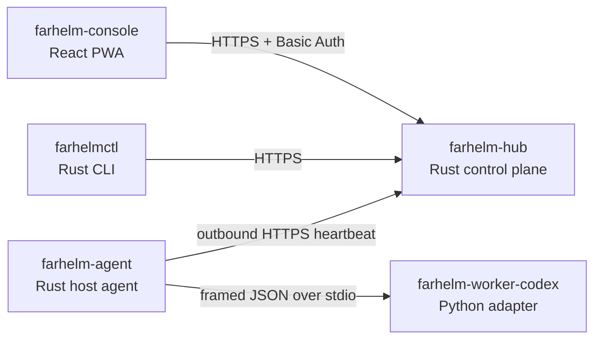

# FarHelm

[简体中文](README.md) · [English](README.en.md)

FarHelm 是一个面向个人科研与 GPU 训练环境的远程控制平面。它把多台训练服务器的状态、训练任务和 Codex 会话汇总到一个移动优先的 Web 控制台中，同时保持训练服务器仅主动出站、源码与凭据留在本机。

> 当前状态：`V0.1.1` 可升级基线修复版。Hub/Agent 支持经过不可变 Release 和 SHA-256 验证的自升级、版本目录原子切换与本地回滚，同时保留异步命令持久化、TTL 和幂等重试；唯一开放动作仍是无副作用的 `agent.probe`。

## 架构



FarHelm 是一个产品和一个 monorepo，但不同运行角色保持最小权限与独立交付：

| 组件 | 职责 | 技术 |
| --- | --- | --- |
| `farhelm-hub` | 公网 API、状态与控制平面 | Rust、Axum、Tokio |
| `farhelm-agent` | 服务器状态、任务与 Worker 管理 | Rust、Tokio |
| `farhelm-console` | 手机与桌面控制台 | React、TypeScript、Ant Design、Vite PWA |
| `farhelm-worker-codex` | Codex SDK 隔离适配层 | Python 3.12、uv |
| `farhelmctl` | 安装、诊断与管理入口 | Rust、Clap |

共享 Rust 类型位于 `crates/`。Hub 与 Agent 分离编译，Worker 不监听网络；Hub 在部署包内托管 Console，开发阶段仍可通过 Vite 代理访问。

## 快速开始

需要 Rust 1.98、Node.js 24、Corepack、Python 3.12 和 [uv](https://docs.astral.sh/uv/)。

```bash
corepack pnpm@10.17.1 --dir farhelm-console install
uv sync --project farhelm-worker-codex --all-groups
```

构建 Console，然后使用仅限本机测试的凭据启动 Hub：

```bash
corepack pnpm@10.17.1 --dir farhelm-console build
FARHELM_ADMIN_USER=admin \
FARHELM_ADMIN_PASSWORD=local-password-1234 \
FARHELM_AGENT_TOKEN=local-agent-token-with-at-least-32-characters \
FARHELM_CONSOLE_DIR=farhelm-console/dist \
FARHELM_HUB_DATABASE=.farhelm/hub.db \
cargo run -p farhelm-hub
```

在另一个终端启动 Console：

```bash
corepack pnpm@10.17.1 --dir farhelm-console dev
```

打开 `http://127.0.0.1:5173`。Hub 健康接口位于 `http://127.0.0.1:8787/api/v1/health`。

验证 CLI 和 Worker：

```bash
cargo run -p farhelmctl -- health
cargo run -p farhelm-agent -- worker-smoke
```

发送一次本机 Agent 心跳：

```bash
FARHELM_HUB_URL=http://127.0.0.1:8787 \
FARHELM_AGENT_TOKEN=local-agent-token-with-at-least-32-characters \
FARHELM_AGENT_ID=gpu-a \
cargo run -p farhelm-agent -- heartbeat
```

## 部署包

在 Linux x86_64 构建两个可安装包。当前二进制运行目标为 Ubuntu 24.04 x86_64（或 glibc 2.39+ 的兼容系统）：

```bash
make release
make test-release
```

普通用户无需编译或登录 GitHub，可直接下载公开 Release：

```bash
curl -fLO https://github.com/Xiiiing/FarHelm/releases/download/V0.1.1/farhelm-hub-0.1.1-linux-x86_64.tar.gz
curl -fLO https://github.com/Xiiiing/FarHelm/releases/download/V0.1.1/farhelm-agent-0.1.1-linux-x86_64.tar.gz
curl -fLO https://github.com/Xiiiing/FarHelm/releases/download/V0.1.1/SHA256SUMS
sha256sum -c SHA256SUMS
```

公网服务器使用 Hub 包，训练服务器使用 Agent 包。训练端为纯用户态安装，不需要 root/sudo；两个包都包含卸载器。完整目录、systemd、Caddy、前台运行和卸载步骤见[部署说明](deploy/README.md)。Hub 必须只监听 loopback 并经 HTTPS 反向代理公开。

首次安装 `V0.1.1` 后无需再手工下载后续版本：Hub 使用 `farhelmctl upgrade --check` / `sudo farhelmctl upgrade`，Agent 使用 `farhelm-agent upgrade --check` / `farhelm-agent upgrade`。升级失败会恢复上一版本，配置和数据库不在版本目录内。

## 开发检查

```bash
make check
make test
make privacy
```

各生态也可以独立运行测试：

```bash
cargo test --workspace
corepack pnpm@10.17.1 --dir farhelm-console test
uv run --project farhelm-worker-codex pytest
```

## 安全边界

- 训练服务器不需要开放新的公网入站端口。
- 训练服务器 Agent 不要求 root 或系统目录写权限；仅使用 XDG 用户数据目录和用户级 systemd unit。
- Hub 拒绝绑定非 loopback 地址；公网 TLS 由 Caddy 或等价反向代理终止。
- 管理员凭据与 Agent token 相互独立，并保存在 `/etc/farhelm/*.env` 权限文件中。
- Hub 不保存 Codex 登录凭据、SSH 私钥或项目源码。
- Worker 仅通过 stdin/stdout 与 Agent 通信，不提供网络服务。
- 首版不会提供任意远程 shell；未来写操作必须经过白名单、TTL、幂等与审计。
- 仓库内的示例配置不得包含真实凭据或私人服务器路径。
- 自升级只识别固定官方仓库中不可变的大写 `V*` Release，不接受任意下载源；跨第一段版本必须由用户显式允许。

## 路线图

1. 在已验证的持久命令底座上加入 WSS 唤醒和 Agent 事件 outbox。
2. 固化 Agent–Worker 协议并验证 Codex SDK 生命周期。
3. 完成单台训练服务器的训练任务与 Codex 会话闭环。
4. 加入 GPU、训练任务、指标、日志和通知。
5. 扩展到多服务器与每 Agent 身份，并验证 canary 升级。

## 许可证

FarHelm 使用 [Apache License 2.0](LICENSE)。
