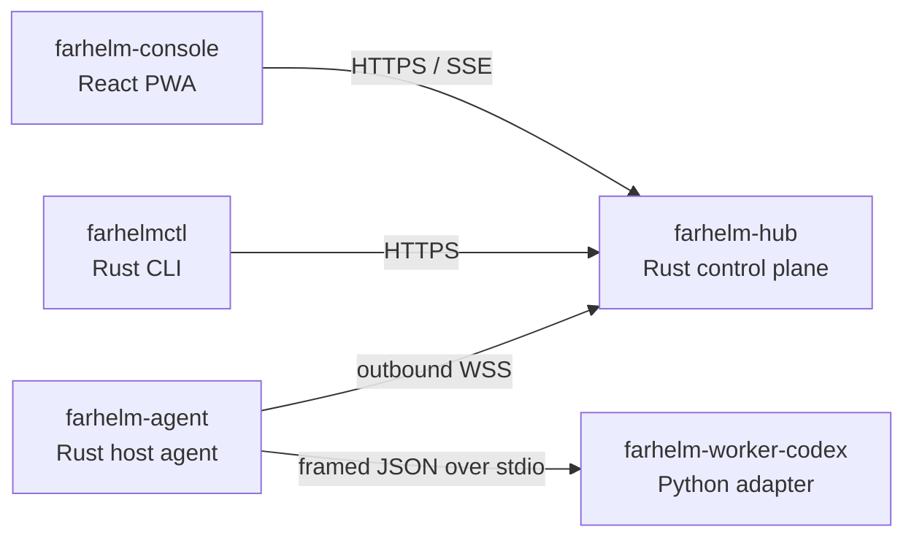

# FarHelm

[简体中文](README.md) · [English](README.en.md)

FarHelm 是一个面向个人科研与 GPU 训练环境的远程控制平面。它把多台训练服务器的状态、训练任务和 Codex 会话汇总到一个移动优先的 Web 控制台中，同时保持训练服务器仅主动出站、源码与凭据留在本机。

> 当前状态：`0.1.0` 项目骨架。仓库目前提供组件边界、健康检查、Agent 与 Worker 握手以及响应式控制台外壳；认证、训练控制、远程 Codex 会话和 Web Push 尚未实现。

## 架构



FarHelm 是一个产品和一个 monorepo，但不同运行角色保持最小权限与独立交付：

| 组件 | 职责 | 技术 |
| --- | --- | --- |
| `farhelm-hub` | 公网 API、状态与控制平面 | Rust、Axum、Tokio |
| `farhelm-agent` | 服务器状态、任务与 Worker 管理 | Rust、Tokio |
| `farhelm-console` | 手机与桌面控制台 | React、TypeScript、Ant Design、Vite PWA |
| `farhelm-worker-codex` | Codex SDK 隔离适配层 | Python 3.12、uv |
| `farhelmctl` | 安装、诊断与管理入口 | Rust、Clap |

共享 Rust 类型位于 `crates/`。Hub 与 Agent 分离编译，Worker 不监听网络，Console 在开发阶段通过代理访问 Hub。

## 快速开始

需要 Rust 1.98、Node.js 24、Corepack、Python 3.12 和 [uv](https://docs.astral.sh/uv/)。

```bash
corepack pnpm@10.17.1 --dir farhelm-console install
uv sync --project farhelm-worker-codex --all-groups
```

启动 Hub：

```bash
cargo run -p farhelm-hub
```

在另一个终端启动 Console：

```bash
corepack pnpm@10.17.1 --dir farhelm-console dev
```

打开 `http://127.0.0.1:5173`。Hub 健康接口位于 `http://127.0.0.1:8787/api/v1/health`。

验证 CLI 和 Worker：

```bash
cargo run -p farhelmctl -- health
cargo run -p farhelm-agent -- worker-smoke
```

## 开发检查

```bash
make check
make test
make privacy
```

各生态也可以独立运行测试：

```bash
cargo test --workspace
corepack pnpm@10.17.1 --dir farhelm-console test
uv run --project farhelm-worker-codex pytest
```

## 安全边界

- 训练服务器不需要开放新的公网入站端口。
- Hub 不保存 Codex 登录凭据、SSH 私钥或项目源码。
- Worker 仅通过 stdin/stdout 与 Agent 通信，不提供网络服务。
- 首版不会提供任意远程 shell；未来写操作必须经过白名单、TTL、幂等与审计。
- 仓库内的示例配置不得包含真实凭据或私人服务器路径。

## 路线图

1. 固化 Agent–Worker 协议并验证 Codex SDK 生命周期。
2. 完成单台训练服务器、Hub 与 PWA 的端到端会话闭环。
3. 加入断线补发、幂等、worktree 隔离与可审查 diff。
4. 加入 GPU、训练任务、指标、日志和通知。
5. 扩展到多服务器并验证原子升级与回滚。

## 许可证

FarHelm 使用 [Apache License 2.0](LICENSE)。
