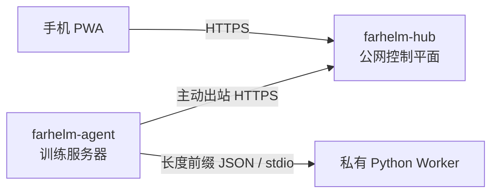

<div align="center">
  
  <h1>FarHelm</h1>
  <p><strong>面向个人科研与 GPU 训练环境的远程控制平面</strong></p>
  <p>从手机查看训练服务器状态，并在不开放训练机入站端口的前提下安全扩展远程控制能力。</p>
  <p>
    <a href="https://github.com/Xiiiing/FarHelm/releases/tag/V0.7.0">V0.7.0</a> ·
    <a href="./deploy/README.md">部署文档</a> ·
    <a href="./README.en.md">English</a>
  </p>
</div>

> [!IMPORTANT]
> `V0.7.0` 加入训练脚本结果上报、统一通知中心和页面提醒，完善 Codex 排队、长消息续读与重启恢复。Codex 正文由 Agent 持久化，Hub 仅短暂中转。训练继续在本地运行。

## 快速安装

正式程序面向 Ubuntu 24.04 x86_64，或带 systemd、glibc 2.39+ 的兼容系统。下载文件就是实际程序，不需要解压安装包。

### Hub

在公网服务器上执行。下载文件可以放在 `/apps`：

```bash
cd /apps
curl -fL https://github.com/Xiiiing/FarHelm/releases/latest/download/farhelm-hub-linux-x86_64 -o farhelm-hub
chmod +x farhelm-hub
sudo ./farhelm-hub install
```

程序只询问管理员用户名和密码，不再要求 TOTP，也不会生成共享 Agent Token。安装后的实际程序位于 `/usr/local/bin/farhelm-hub`；登录网页后在“服务器 → 添加服务器”生成一次性 8 位配对码。

### Agent

在训练服务器上使用目标普通用户执行，不要使用 sudo：

```bash
mkdir -p "$HOME/apps"
cd "$HOME/apps"
curl -fL https://github.com/Xiiiing/FarHelm/releases/latest/download/farhelm-agent-linux-x86_64 -o farhelm-agent
chmod +x farhelm-agent
./farhelm-agent install
```

程序只询问 Hub HTTPS 地址和网页生成的 8 位配对码，独立 256-bit Token 会自动领取并写入 `0600` 配置。安装后的实际程序位于 `${XDG_BIN_HOME:-$HOME/.local/bin}/farhelm-agent`；成功后可以删除下载副本。

更完整的非交互安装、Caddy、systemd、迁移和卸载说明见[部署文档](deploy/README.md)。

## 日常使用

Hub 与 Agent 各自只有一个面向用户的程序入口：

| 项目 | Hub | Agent |
| --- | --- | --- |
| 配置 | `/etc/farhelm/hub.toml` | `${XDG_CONFIG_HOME:-$HOME/.config}/farhelm/agent.toml` |
| 服务 | systemd 系统服务 | systemd 用户服务 |
| 权限 | 使用 sudo | 普通用户，不使用 sudo |
| 日志 | `journalctl -u farhelm-hub` | `journalctl --user -u farhelm-agent` |

```bash
# Hub
sudo farhelm-hub doctor
sudo farhelm-hub status
sudo farhelm-hub restart
sudo farhelm-hub update --check
sudo farhelm-hub update
sudo farhelm-hub rollback
sudo farhelm-hub admin reset-password

# Agent
farhelm-agent doctor
farhelm-agent status
farhelm-agent restart
farhelm-agent update --check
farhelm-agent update
farhelm-agent rollback
farhelm-agent pair

# 查看旧 Codex 会话
farhelm-agent codex sessions --project cc08

# 登记现有训练 PID；prompt 只从文件或 stdin 读取
farhelm-agent experiment watch --project cc08 --pid 12345 \
  --session ses_xxx --log outputs/exp42/train.log \
  --on-success-prompt-file next-step.txt
farhelm-agent experiment list
```

如果当前 shell 尚未包含 `~/.local/bin`，暂时使用完整路径 `~/.local/bin/farhelm-agent`。升级会验证不可变 Release、长度、SHA-256、角色和版本；激活失败会自动恢复本地 previous。

## 训练结束上报与通知

在训练循环外调用一次，记录整批结果；每轮记录请把调用放到循环内，并给每轮不同的 `--run-id`：

```bash
farhelm-agent experiment report --project cc08 --run-id batch-20260907 \
  --name "8 轮训练" --status succeeded --message "全部训练完成"

# 只在成功时向同项目的会话排队；指令文件只在 Agent 本地读取
farhelm-agent experiment report --project cc08 --run-id batch-with-followup \
  --name "8 轮训练" --exit-code 0 --session ses_xxx \
  --on-success-prompt-file next-step.txt

# 从 stdin 读取最多 2 KiB 的自定义消息
printf '训练失败，请登录查看详情' | farhelm-agent experiment report \
  --project cc08 --name "训练结果" --status failed --message -
```

成功返回 `run_id`、`event_id` 和 `stored_locally: true`，表示 Agent 本地事务已提交。Agent 服务停止或 Hub 断网时也可保存，服务恢复后补发；浏览器页面收到提醒是后续独立步骤。同 Agent、项目和显式 run ID 的相同内容重试返回原收据，内容改变则冲突。省略 run ID 会创建新记录。名称最多 128 字符；结果支持 succeeded、failed、unknown，或互斥的退出码（0 成功）。

[Bash 示例](examples/experiment-report.sh)和 [Python 示例](examples/experiment-report.py)通过退出捕获报告失败，保留训练退出码，不要求安装 Python SDK。脚本未运行到上报、机器断电或 SIGKILL 无法由单次上报推断结果，仍可使用 PID watch 兜底。成功续话有效期 24 小时，失败与 unknown 只通知。

通知中心支持分页、类型/Agent/结果筛选、未读同步和结果详情。设置页支持系统/浅色/深色主题、实验/Codex 页面提醒开关及页面测试通知。保持 FarHelm 页面打开即可接收完成提醒，点击提醒进入对应详情；初次进入与重连补历史不会批量弹出旧提醒。本版范围为浏览器页面通知，iOS 系统推送留待后续版本。

网页指令和调度在 Agent 保存后才确认提交；失败时当前页面保留草稿并沿用操作身份重试。运行中的任务在 Agent 重启后按已保存的终态收据恢复；无终态收据时标记 orphaned，不自动重放。升级先 Hub 后 Agent，新正文交付要求 Agent 的 V0.7 能力标识。

## 当前实现

- `farhelm-hub`：Rust 控制平面、密码登录、SQLite 30 天会话、短码配对、Secure HttpOnly Cookie、CSRF、登录限速、可靠事件、SSE 补发和 Web Push。
- `farhelm-agent`：普通用户出站连接、自动发现 Codex 项目、本地项目授权表、明确登记的 PID 监视、PID 复用防护、SQLite inbox/outbox 和隔离 worktree。
- `farhelm-console`：React、TypeScript、Ant Design、Vite PWA；提供实验与 Codex 手机/桌面界面、流式回复和通知深链处理。
- `farhelm-worker-codex`：Agent 私有 Python stdio 适配层，固定 `openai-codex==0.147.0`，覆盖 thread list/start/resume 与 turn start/steer/interrupt。

所有远程动作都是固定类型；不接受 action、cwd、argv、环境变量或 shell 文本。训练仍由用户原有方式启动和停止。

## 架构



FarHelm 是一个 monorepo，但 Hub 与 Agent 分离编译并保持不同权限与攻击面。Worker 不监听网络，也不持有 Hub token。

## 本地开发

需要 Rust 1.98、Node.js 24、Corepack、Python 3.12 和 [uv](https://docs.astral.sh/uv/)。

```bash
corepack pnpm@10.17.1 --dir farhelm-console install
uv sync --project farhelm-worker-codex --all-groups
corepack pnpm@10.17.1 --dir farhelm-console build
cargo run -p farhelm-hub -- serve --config /path/to/hub.toml
```

示例配置位于 `farhelm-hub/hub.example.toml` 和 `farhelm-agent/agent.example.toml`。

完整检查：

```bash
make check
make test
make privacy
make test-ui
make test-release
```

## 安全与版本规则

- Agent 不需要 root，也不开放公网入站端口；Hub 只监听 loopback，由 Caddy 或等价 HTTPS 反向代理公开。
- 管理员密码使用 Argon2id；浏览器 session 和 Agent Token 在 Hub 只保存哈希，原始 Agent Token 仅在配对响应中传输一次。
- Hub 不保存 Codex 登录凭据、SSH 私钥、项目源码或完整本地日志。
- Worker 只通过 stdin/stdout 与 Agent 通信；写操作必须经过白名单、TTL、幂等和审计。
- 版本使用 `MAJOR.MINOR.PATCH`：第一段只能由用户决定，功能提升第二段，纯修复提升第三段。
- GitHub Releases 只保留最新正式版本；历史 Git 标签保留但不复用。在线更新只升级到最新版本，降级只使用本机 previous。

## 路线图

1. 在 A6000/CC08、Titan/work831 与 3090/work832 完成 V0.7 部署 canary。
2. 开发 iOS 客户端并补充系统通知与真机后台验收。
3. 按实际实验需求评估 GPU 指标与 TensorBoard；不加入远程训练控制。

## 许可证

FarHelm 使用 [Apache License 2.0](LICENSE)。
