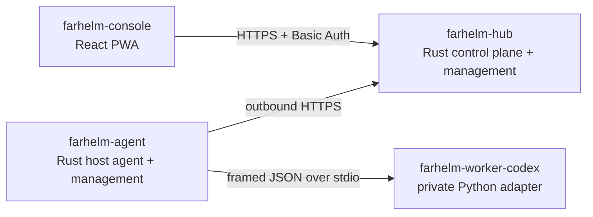

# FarHelm

[简体中文](README.md) · [English](README.en.md)

FarHelm 是一个面向个人科研与 GPU 训练环境的远程控制平面。它把多台训练服务器的状态、训练任务和 Codex 会话汇总到一个移动优先的 Web 控制台中，同时保持训练服务器仅主动出站、源码与凭据留在本机。

> 当前状态：`V0.3.0` 角色原生单程序版。下载文件就是实际的 Hub 或 Agent，不再是展开旧安装包的引导器。安装、配置校验、启停、重启、状态、升级、回滚和卸载均由对应程序提供。当前开放动作仍只有无副作用的 `agent.probe`。

## 架构



FarHelm 是一个产品和一个 monorepo，但 Hub 与 Agent 保持不同的权限和攻击面：

| 组件 | 职责 | 技术 |
| --- | --- | --- |
| `farhelm-hub` | 公网 API、Console、状态、服务与升级管理 | Rust、Axum、Tokio |
| `farhelm-agent` | 服务器状态、任务、Worker、服务与升级管理 | Rust、Tokio |
| `farhelm-console` | 手机与桌面控制台；正式构建嵌入 Hub | React、TypeScript、Ant Design、Vite PWA |
| `farhelm-worker-codex` | Agent 私有的 Codex SDK 隔离适配层 | Python 3.12、uv |

共享 Rust 类型位于 `crates/`。Worker 不监听网络，也不持有 Hub token。

## 开发快速开始

需要 Rust 1.98、Node.js 24、Corepack、Python 3.12 和 [uv](https://docs.astral.sh/uv/)。

```bash
corepack pnpm@10.17.1 --dir farhelm-console install
uv sync --project farhelm-worker-codex --all-groups
```

复制 `farhelm-hub/hub.example.toml`，把 `hub.console_dir` 指向 `farhelm-console/dist`，然后启动：

```bash
corepack pnpm@10.17.1 --dir farhelm-console build
cargo run -p farhelm-hub -- serve --config /path/to/hub.toml
```

验证 Hub 和 Worker：

```bash
cargo run -p farhelm-hub -- health
cargo run -p farhelm-agent -- worker-smoke
```

发送一次本机 Agent 心跳：

```bash
cargo run -p farhelm-agent -- heartbeat --config /path/to/agent.toml
```

## 下载和安装

正式目标为 Ubuntu 24.04 x86_64，或带 systemd、glibc 2.39+ 的兼容系统。Hub 下载后执行：

```bash
curl -fL https://github.com/Xiiiing/FarHelm/releases/latest/download/farhelm-hub-linux-x86_64 -o farhelm-hub
chmod +x farhelm-hub
sudo ./farhelm-hub install
```

训练服务器使用普通用户安装 Agent，不使用 sudo：

```bash
curl -fL https://github.com/Xiiiing/FarHelm/releases/latest/download/farhelm-agent-linux-x86_64 -o farhelm-agent
chmod +x farhelm-agent
./farhelm-agent install
```

缺少配置时程序会交互询问必要值。自动化安装仍可使用 `FARHELM_ADMIN_USER`、`FARHELM_ADMIN_PASSWORD`、`FARHELM_AGENT_TOKEN`、`FARHELM_HUB_URL` 和 `FARHELM_AGENT_ID` 环境变量，秘密不要写在命令行参数中。

安装后的统一命令：

```bash
sudo farhelm-hub status
sudo farhelm-hub restart
sudo farhelm-hub update --check
sudo farhelm-hub update
sudo farhelm-hub rollback

farhelm-agent status
farhelm-agent restart
farhelm-agent update --check
farhelm-agent update
farhelm-agent rollback
```

配置位置：

- Hub：`/etc/farhelm/hub.toml`
- Agent：`${XDG_CONFIG_HOME:-$HOME/.config}/farhelm/agent.toml`

程序位置、配置、数据库、systemd unit、完整卸载和 Caddy 配置见[部署说明](deploy/README.md)。Hub 必须只监听 loopback，并通过 Caddy 或等价 HTTPS 反向代理公开。

## 开发检查

```bash
make check
make test
make privacy
make test-ui
make test-release
```

## 安全边界

- 训练服务器不开放新的公网入站端口，Agent 不需要 root。
- Hub 拒绝绑定非 loopback 地址；公网 TLS 由反向代理终止。
- 管理员凭据和 Agent token 相互独立，TOML 配置采用受限权限。
- Hub 不保存 Codex 登录凭据、SSH 私钥或项目源码。
- Worker 仅通过 stdin/stdout 与 Agent 通信。
- 不提供任意远程 shell；写操作必须经过白名单、TTL、幂等和审计。
- 自升级只接受固定官方仓库中不可变的大写 `V*` Release 和版本化实际二进制；跨第一段版本必须由用户明确允许。
- `V0.3.0` 保留一次兼容归档，使大写正式序列的 V0.2.0 可迁移；新安装和后续升级不再操作归档目录。

## 路线图

1. 加入 WSS 唤醒和 Agent 事件 outbox。
2. 验证正式 Codex SDK 生命周期并扩展 Worker 协议。
3. 完成单台训练服务器的训练任务与 Codex 会话闭环。
4. 加入 GPU、训练指标、日志和 Web Push 通知。
5. 扩展到多服务器并验证 canary 升级。

## 许可证

FarHelm 使用 [Apache License 2.0](LICENSE)。
